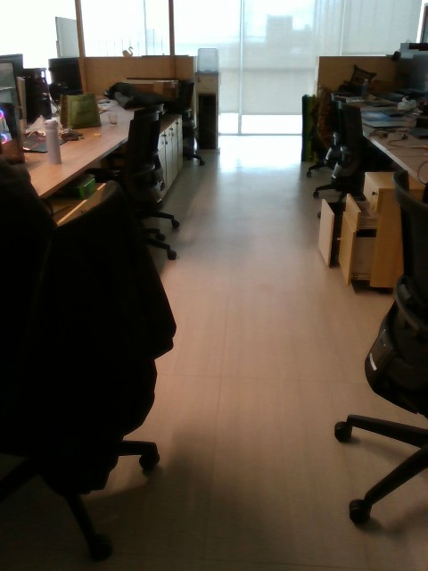
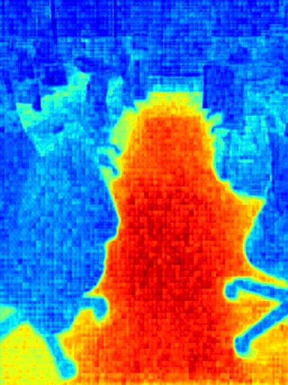

# GeNIE SAM-TP and BEV Path Planner

This repository provides inference and visualization code for **SAM-TP**, a customized version of SAM2 tailored for pixel-wise traversability prediction, plus an offline BEV path planner that projects SAM-TP predictions into robot-centric bird's-eye-view traversability maps. SAM-TP is the perception core of [GeNIE: A Generalizable Navigation System for In-the-Wild Environments](https://arxiv.org/abs/2506.17960), where it enables robust terrain understanding across diverse environments.


### 📄 Paper

**GeNIE: A Generalizable Navigation System for In-the-Wild Environments**

Jiaming Wang*, Diwen Liu*, Jizhuo Chen*, Jiaxuan Da, Nuowen Qian, Tram Minh Man, [Harold Soh](https://haroldsoh.com/)

---

## 🔧 Setup

### 1. Clone the repository and create a virtual environment

```bash
git clone https://github.com/jiaming-ai/GENIE.git
cd GENIE

conda env create -n sam_tp -f environment.yml
conda activate sam_tp
```

### 2. Make sure PyTorch is installed.
If it's not installed in the virtual environment, you should install it according to your cuda version.
For example, for the **nightly build with CUDA 12.8**, run:

```bash
pip3 install torch torchvision --index-url https://download.pytorch.org/whl/cu128
```

> 🔗 Visit [https://pytorch.org/get-started/locally/](https://pytorch.org/get-started/locally/) to find the correct install command for your setup.

### 3. Install the package from the repository root

```bash
pip install -e .
```

---

## 📦 Model Configuration and Checkpoint

The script uses the following paths:

* Model config:
  `sam2/configs/sam2.1_inference_tiny/sam2.1_custom2.yaml`
* Checkpoint:
  `sam2_logs/configs/sam2.1_training_tiny/sam2_training_custom2_freezeNoneNone_f57.yaml/checkpoints/checkpoint_2.pt`
  
🔔 Note: The checkpoint file is not included in the repository.
To use the model, please download the checkpoint manually from the link below and place it in the expected directory.

### 📥 Download Checkpoint

Manually download the model checkpoint from:

🔗 [Google Drive – SAM2 Checkpoint](https://drive.google.com/drive/folders/190yHH-TcfQVoByZeB1809sPIR62CsBD1?dmr=1&ec=wgc-drive-hero-goto)

Then place the `checkpoint_2.pt` file at the following location:

```
sam2_logs/configs/sam2.1_training_tiny/sam2_training_custom2_freezeNoneNone_f57.yaml/checkpoints/checkpoint_2.pt
```

---

### ✅ Usage

#### To use it in your code
```python
from sam2.sam_tp import SAM_TP

model_cfg = "path/to/config.yaml"
checkpoint = "path/to/checkpoint.pt"

sam_tp = SAM_TP(model_cfg, checkpoint)
image = ...  # your (H, W, 3) RGB image as a NumPy array

result = sam_tp.run_sam2_inference(image)

heatmap = result["heatmap"]        # heatmap for visualization
score_map = result["logits"]       # (H, W) raw logits
```

#### To test in CLI

```bash
python visualize_heatmap.py \
  --input_path /path/to/image.jpg \
  --output_dir /path/to/output/
```

* `--input_path`: Path to the input image (JPG or PNG)
* `--output_dir`: Directory where the output heatmap and score map will be saved

---

## 🧭 BEV Path Planner

This repository also includes an offline GeNIE path-planning entry point:

```bash
python run_path_planner.py \
  --config configs/stretch_path_planner.yaml \
  --image /path/to/rgb.png \
  --goal-x -2.0 \
  --goal-y 8.0 \
  --mode rgb
```

If `camera.intrinsics` and `camera.pose` are set in the config, `--camera-k`
and `--camera-pose` are optional. Pass those flags only when you want to
override the fixed config values for a particular observation.

The planner runs the same high-level stages used by the live Stretch prototype, but without any low-level robot control:

1. Run SAM-TP on an RGB image, or load a saved traversability/logit map.
2. Project image traversability into a local BEV map using camera intrinsics and a per-frame camera pose.
3. Optionally project depth into a BEV obstacle-height traversability map.
4. Optionally blend RGB and depth BEVs into RGB-D traversability.
5. Optionally fuse multiple past observations into the current planning frame.
6. Sample a fixed polynomial path bank.
7. Filter high-cost paths, optionally cluster remaining paths, bias branch selection toward the goal, compute path costs, and save the final path.

### Bundled Stretch Example

The repository includes one captured Stretch RGB-D observation under
`stretch_example/stretch_obs/`. After downloading the checkpoint, run:

```bash
bash plan_from_obs.sh
```

This uses `configs/stretch_path_planner.yaml`, the bundled `rgb.png` and
`depth_m.npy`, and the fixed camera values in the config. It writes timestamped
planner outputs to `stretch_example/stretch_obs/planner_output/`, including:

* `*.png`: BEV planner visualization with sampled and selected paths.
* `*_cli_observation_samtp.png`: SAM-TP traversability heatmap for the input image.
* `*_final_path_xy_m.npy`: final path as `[x_right_m, y_forward_m]` points.
* `*.json`: metadata and exact output paths.

The same command can be expanded for a new observation by replacing `--image`,
`--depth`, and optionally passing `--camera-k` / `--camera-pose` if the camera
values are not fixed in the config.

### RGB-D Example

Depth is optional. To enable RGB-D mode, provide aligned depth and keep `depth.enabled: true` plus `planning.mode: rgbd` in the config:

```bash
python run_path_planner.py \
  --config configs/stretch_path_planner.yaml \
  --image /path/to/rgb.png \
  --depth /path/to/depth_m.npy \
  --goal-x -2.0 \
  --goal-y 8.0 \
  --mode rgbd
```

Depth inputs can be `.npy` arrays in meters or image files in millimeters. Set `depth.unit: m` or `depth.unit: mm` in the config. Depth must be registered to the RGB image and use the same intrinsics.

### Skipping SAM-TP For Debugging

If you already have a saved SAM-TP score map, you can bypass model loading:

```bash
python run_path_planner.py \
  --config configs/stretch_path_planner.yaml \
  --image /path/to/rgb.png \
  --score-map /path/to/samtp_traversability.npy \
  --score-map-type traversability \
  --depth /path/to/depth_m.npy \
  --goal-x -2.0 \
  --goal-y 8.0 \
  --mode rgbd
```

Use `--score-map-type logits` if the `.npy` file contains raw logits; the config's `samtp.score_transform` controls conversion to traversability.

### Required Inputs

For a single RGB-only plan, you need:

* RGB image: `H x W x 3`, readable by Pillow.
* Camera intrinsics: a `3 x 3` pinhole matrix matching the image resolution, either in `camera.intrinsics` / `camera.intrinsics_path` or passed with `--camera-k`.
* Camera pose: `T_world_camera`, a `4 x 4` camera-to-world matrix, either in `camera.pose` / `camera.pose_path` or passed with `--camera-pose`.
* Goal: `goal_x`, `goal_y` in meters, where `+x` is robot right and `+y` is robot forward.
* SAM-TP checkpoint, unless `--score-map` or per-observation `score_map` is supplied.

For a single CLI observation passed with `--image` or `--score-map`,
`--camera-k` and `--camera-pose` override the global `camera.*` values in the
config. For YAML `observations`, each observation's `camera.*` values override
the global `camera.*` values. For fixed-camera embodiments, keeping
`camera.intrinsics` and `camera.pose` in the config is enough. For moving-camera
setups, override `camera.pose` with the exact pose for each captured frame.

For depth fusion, you additionally need:

* Aligned depth for the same camera frame.
* Depth scale via `depth.unit`.
* A ground plane height `projection.ground_z` in the same world frame as `T_world_camera`.
* `depth.obstacle_height_thresh_m`, where cells at or above this height are treated as non-traversable.

### Pose And Frame Conventions

The projection code assumes an optical camera frame:

* camera `+x`: image right
* camera `+y`: image down
* camera `+z`: forward through the image plane

`T_world_camera` maps points from this optical camera frame into a world/odom frame with `z` up. The RGB projection intersects camera rays with the plane `world_z = projection.ground_z`.

If you provide only `T_world_camera`, the planner reference frame is the camera ground frame. For robot-centered goal coordinates, provide a robot pose too:

```yaml
observations:
  - name: frame_0001
    image: data/frame_0001_rgb.png
    depth: data/frame_0001_depth_m.npy
    camera:
      pose_path: data/frame_0001_T_world_camera.npy
    robot_pose_xy_yaw: [0.0, 0.0, 0.0]
```

`robot_pose_xy_yaw` is `[x_m, y_m, yaw_rad]` in the world/odom frame. The robot base convention is `+x` forward, `+y` left, `+z` up. If you do not have `T_world_camera` directly, provide `robot_pose_xy_yaw` plus a calibrated `camera.T_base_camera` matrix in the config; the planner computes `T_world_camera = T_world_base @ T_base_camera`.

### Fusing Past Observations

Temporal observation fusion is configured entirely in YAML:

```yaml
observation_fusion:
  enabled: true
  max_observations: 4
  reference: last

observations:
  - name: frame_0001
    image: data/frame_0001_rgb.png
    depth: data/frame_0001_depth_m.npy
    score_map: data/frame_0001_samtp_traversability.npy
    score_map_type: traversability
    camera:
      pose_path: data/frame_0001_T_world_camera.npy
    robot_pose_xy_yaw: [0.0, 0.0, 0.0]
  - name: frame_0002
    image: data/frame_0002_rgb.png
    depth: data/frame_0002_depth_m.npy
    camera:
      pose_path: data/frame_0002_T_world_camera.npy
    robot_pose_xy_yaw: [0.2, 0.0, 0.0]
```

Every fused observation must have a camera pose in the same world/odom frame. Robot pose is strongly recommended because it makes the fused BEV and goal coordinates robot-base centered; otherwise the reference is the camera pose. `reference: last` means the final observation defines the local planning frame.

### Stretch Example Config

`configs/stretch_path_planner.yaml` contains the current Stretch defaults used by our prototype:

* head-camera intrinsics captured from the Stretch stream at 480x640 image resolution:
  `fx=606.1236`, `fy=606.0801`, `cx=247.5605`, `cy=325.1680`
* example fixed `T_world_camera` fallback for the prototype Stretch head-camera pose
* local BEV: `4.0 m` forward by `4.0 m` wide at `0.03 m/px`
* depth reliable range: `2.4 m`
* depth obstacle threshold: `0.20 m`
* RGB-D blend weights: RGB `0.2`, depth `0.8`
* fixed polynomial path bank with optional clustering enabled

Stretch camera pose changes with base/head motion. Use the config `camera.pose`
only when the camera pose is fixed for the observation. Otherwise use the
per-frame `camera_pose` from your Stretch observation stream, or save it next to
each image as a `.npy` file and pass it with `--camera-pose`.

For a newly captured moving Stretch frame, save the RGB image, aligned depth,
camera intrinsics, and per-frame camera pose together, then run:

```bash
python run_path_planner.py \
  --config configs/stretch_path_planner.yaml \
  --image stretch_example/stretch_obs/rgb.png \
  --depth stretch_example/stretch_obs/depth_m.npy \
  --camera-k stretch_example/stretch_obs/camera_K.npy \
  --camera-pose stretch_example/stretch_obs/camera_pose.npy \
  --goal-x 0.0 \
  --goal-y 10.0 \
  --mode rgbd \
  --output-dir stretch_example/stretch_obs/planner_output
```

### Outputs

Each run writes:

* `*_fused_bev.png`: fused traversability map.
* `*.png`: final planner visualization; black is unknown, green is low cost, red is high cost, gray lines are the fixed path bank, orange lines are selected candidates, white is the final path, cyan is the goal.
* `*_fused_bev_traversability.npy`: BEV traversability in `[0, 1]`, with `-1` for unknown.
* `*_cost.npy`: planner cost map.
* `*_final_path_pixels.npy`: final path in planner row/column coordinates.
* `*_final_path_xy_m.npy`: final path as `[x_right_m, y_forward_m]`, relative to the selected reference frame.
* `*.json`: metadata and all output paths.

The path planner intentionally does not send commands to a robot. A downstream controller should consume `*_final_path_xy_m.npy` and convert it into robot-specific low-level commands.

---

### 🧪 Example Inference Output

We run **SAM-TP** on an input image to predict traversable areas. The result is visualized as a color-coded heatmap, where:

> 🔴 **Red** regions are **easier to navigate**
> 🔵 **Blue** regions are **harder to navigate**

<div align="center">

<table>
  <tr>
    <td align="center"><strong>Input Image</strong></td>
    <td align="center"><strong>Traversability Heatmap</strong></td>
  </tr>
  <tr>
    <td></td>
    <td></td>
  </tr>
</table>

</div>

---


### 🔖 Citation

If you use **SAM-TP** or the **GeNIE system** in your research, please cite our paper:

**[GeNIE: A Generalizable Navigation System for In-the-Wild Environments](https://arxiv.org/abs/2506.17960)**
Jiaming Wang\*, Diwen Liu\*, Jizhuo Chen\*, Jiaxuan Da, Nuowen Qian, Tram Minh Man, Harold Soh

```bibtex
@article{wang2024genie,
  title={GeNIE: A Generalizable Navigation System for In-the-Wild Environments},
  author={Wang, Jiaming and Liu, Diwen and Chen, Jizhuo and Da, Jiaxuan and Qian, Nuowen and Man, Tram Minh and Soh, Harold},
  journal={arXiv preprint arXiv:2506.17960},
  year={2024}
}
```


---
